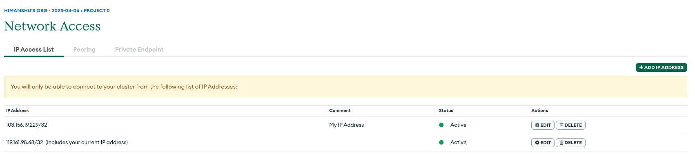

# INTERNATIONAL INSTITUTE OF INFORMATION TECHNOLOGY,  BANGALORE


### SOFTWARE PRODUCTION ENGINEERING - FINAL PROJECT

## SOCIAL MEDIA WEBSITE
### Stay connected with others

In the supervision of :- Prof B.Thangaraju  
Teaching Assistant :- Vishal Rai  
Team Member Details :-

| Name | Roll No. | 
| :--------: | :--------: | 
| Prafull Pandey | MT2022150 | 
| Himanshu Digrase | MT2022155 |

<center>20.04.2023</center>

\pagebreak

Index   
toc: yes

\pagebreak

### 1. ABSTRACT
  
Our social media website is a platform where people can connect, share information, and engage with each other in meaningful ways. Users can create profiles, share updates, photos, and follow the activities of other users. Our website is designed to foster positive interactions and provide a safe, inclusive space for people of all backgrounds and identities. With powerful privacy and security features. Our social media website aims to bring people together and create a vibrant online community where individuals can express themselves, learn from others, and build meaningful relationships.


### 2. INTRODUCTION
#### a. OVERVIEW 

A social media website is an online platform where people can connect, share information, and engage with each other in a variety of ways. Social media websites typically allow users to create a profile, post updates, photos, and videos, join groups and communities, and follow the activities of other users.

One of the primary features of social media websites is the ability to interact with other users through comments, likes, and shares. This creates a sense of community and encourages users to engage with each other in positive and meaningful ways.

Social media websites can be used for a wide range of purposes, from personal communication and entertainment to business marketing and professional networking. They can also be used to share news and information, discuss social issues, and mobilize for social causes.

#### b. FEATURES

#### c. Why DevOps?
DevOps is a set of tools that automate software development and IT
operations. It focuses on shortening the systems development life cycle and
providing continuous delivery with high software quality. DevOps is one up on Agile software development; multiple DevOps aspects
came from the Agile methodology.  
● It optimizes the overall business by increasing efficiency through automation.  
● Improves software development and deployment speed and stability.  
● Deployment failures, rollbacks, and recovery time are all reduced.  
● Improved collaboration and communication; lower costs and IT headcount

### 3. TOOLS USED

1. Version Control System : Git and GitHub
https://github.com/himanshudigrase/SocialWeb
2. Continuous Integration/Continuous Delivery : Github Actions
3. Building Tool : NPM (Node Package Manager)
4. Testing : Mocha framework
5. Containerization : Docker  
https://hub.docker.com/r/hims0301/backend  
https://hub.docker.com/r/hims0301/frontend
6. Deployment : Ansible
7. Log creation, monitoring and visualization : ELK (Elasticsearch,Logstash, Kibana)
8. Frontend Development : React.js, Vite
9.  Backend Development : Node.js, Express.js
10. Database : MongoDB


### 4. SYSTEM CONFIGRATION
1. Operating System - Linux Ubuntu 22
2. CPU & RAM - 4 core processor and 8GB RAM
3. Kernel Version - 5.4.0-89-generic
4. Database - MongoDB 4.4.5

/pagebreak

### 5. SOFTWARE DEVELOPEMENT LIFECYCLE- SDLC

#### i. INSTALLATIONS
The frontend(client) of the project uses React.js and the
backend(server) is built using Node.js, Express.js and the database is using
MongoDB. To begin with, install nodejs on the system.

#### ii. NODEJS INSTALLATION

Node.js is a javascript programming package management. It is the JavaScript runtime environment Node.js' default package manager. It
comes pre-installed with Node.js. The package.json file contains the definitions for all npm packages. Package.json's content must be in JSON
format. The definition file must have at least two fields. The names and variants are as follows. It is capable of managing dependencies. It installs all of the project's dependencies in a single command line. The package.json file also defines dependencies. 
 
Inorder to run React, node environment shall be installed before starting React app

```bash
sudo apt-get install nodejs
sudo apt-get install npm
```

Run npm install command inside the frontend and backend folder to install
all the necessary dependencies of the project.

```bash
sudo npm install
```


#### iii. MONGODB
We create a mongodb database on atlas to store all the user and posts information. To set this database with our project use create URI
and store it in the .env file


#### iv. Create a cluster on MONGO-DB Atlas




Set Network Access to 0.0.0.0/0 so that the website can be accessed
from all IP addresses. This is ideal for real time development project, for
development we can set a few specific addresses.

#### v. Connect app to database


Add the above URL to .env to connect to the database. Replace the username with mongodb’s username and set the password for the same.
Change the database name at myFirstDatabase, to your specific database name.

Database Entries from - Browse Collections


### vi. Store MongoDB URL in .env file
By creating a.env file in the api (backend) subdirectory, you can save
the cluster's URL. In that URL, provide all of the MongoDB Atlas' credentials
(password). This.env file is part of.gitignore. Furthermore, Mongoose uses
the variable used to store this URL to connect to MongoDB.


### vii. JWT Authentication

JSON Web Tokens (JWT) are an RFC 7519 open industry standard for representing claims between two parties. For example, you can use jwt.io to decode, verify, and produce JWT.


JWT defines a concise and self-contained way for transmitting information between two parties as a JSON object. This information may be reviewed and trusted because it is signed. A secret (using the HMAC algorithm) or an RSA or ECDSA public/private key pair can be used to sign JWTs.

We create the JWT token and add it to .env file for performing authentication.

### viii. Source Code Management
Source code management (SCM) is used to keep a track of all the
modifications done to a source code repository. SCM tracks a current
history of changes to a code base and helps resolve conflicts when merging
updates from multiple contributors. SCM is very similar to Version control.


To integrate project with GitHub we do the following steps :  
● git init  
➔ Initializes the project as a github repository locally.  
● git remote add origin  
➔ Add the details of the remote branch.  
● git add   
➔ This command stages all the changes of local repo.  
● git commit   
➔ Commit command commits the changes to the
respective branch in the current repository.  
● git push  
➔ Push command will push the changes to the remote
repository on GitHub.  


### ix. Testing
To make sure the project is running alright we provide a set of test
cases. We use a library called ‘Jest’. Jest is a JavaScript test
framework running on Node. js and in the browser. Jest is a testing framework developed by Facebook. Originally designed to make UI testing easier for React developers, it’s now a full standalone suite of tools for any type of JavaScript project (including Node.js) and includes features such as a built-in assertion library, code coverage, and mocking. Jest also runs multiple test suites concurrently, which can speed up the overall testing process. The downside of parallel execution is it can make debugging tests more difficult.

### ix. Testing
For anyone coming from a BDD-style of Mocha, Jest tests are pretty familiar looking. Jest adds several global functions to help with setting up and running tests, such as describe, it, expect, and the jest object (used mostly for mocking).


### x. Containerization
Docker is an open source platform for developing, shipping, and
running applications. Docker enables users to separate your applications from your infrastructure so you can deliver software quickly. This allows us to deploy products directly to users' computers without installing each software one-by-one.  
  
We need to create an account on DockerHub, which is a public registry.  
  
We then push our created image on this repository, this is publicly
available and can be pulled by any user and deployed on a local machine.  


### xi. Create repository on docker-hub
Link :  
a. https://hub.docker.com/r/hims0301/backend  
b. https://hub.docker.com/r/hims0301/frontend  
c. https://hub.docker.com/repositories  


  
Docker holds a set of all the commands a user could call on the command
line to assemble an image. For our node project we set to copy the
package.json and package-lock.json to the container and then run npm
install to install all the packages there.

### xii. CI/CD Pipeline
Continuous Integration : Continuous integration (CI) is the practice of
automating the integration of code changes from multiple contributors into
a single software project.  

Continuous Delivery : Continuous Delivery is the ability to get changes of
all types such as including new features, configuration changes, bug fixes
and experiments into production, or into the hands of users, safely and
quickly in a sustainable way.
We use Github Actions to build our CI/CD pipeline.  
  
 CI/CD Pipeline
Continuous Integration : Continuous integration (CI) is the practice of
automating the integration of code changes from multiple contributors into
a single software project.  

Continuous Delivery : Continuous Delivery is the ability to get changes of
all types such as including new features, configuration changes, bug fixes
and experiments into production, or into the hands of users, safely and
quickly in a sustainable way.
We use Github Actions to build our CI/CD pipeline.

First launched in 2018 as a platform-native automation tool, GitHub
Actions has evolved to give developers powerful automation and
CI/CD (continuous integration/continuous deployment) capabilities
right next to your code in GitHub.
At its core, GitHub Actions is designed to help simplify workflows with
16flexible automation and offer easy-to-use CI/CD capabilities built by
developers for developers.

### xiii. Getting started with github actions
Github actions is a famous platform in recent times to automate
developer workflows. CI/CD pipelines is one of the many workflows
offered by github to automate work processes.  
  

### xiv. Setting up github actions
All the required YAML files are placed in the .github/ directory which
will be triggered on github action basis. Workflow is a collection of jobs
and these jobs will run on the trigger of an event.

### xv. Github Workflows:(FRONTEND)

